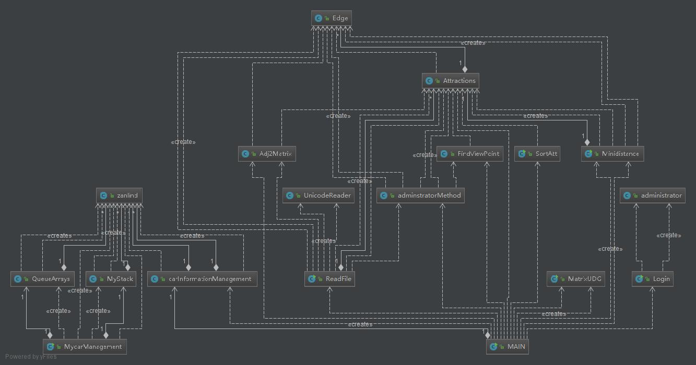

#注意事项：
<li>与管理员登录相关的数据库文件在DB.sql文件内
<li>运行系统的主函数在MAIN类中
<li>管理员操作中，如果修改了景点信息，并且保存入文件中，需要重新运行系统
<li>管理员用户名：admin 密码：123456
<li>所有文件的编码格式均为utf-8

#创新：
<li>在最短路算法中，dijkstra算法使用了最优化，将时间
复杂度优化为时间复杂度为O((n + e)log(n))。代码在：ViewPoint文件下
Minidistance类中107行。 同时使用了spfa算法，SPFA 算法是 Bellman-Ford
算法 的队列优化算法的别称，通常用于求含负权边的单源最短路径
，以及判负权环。SPFA 最坏情况下复杂度和朴素 Bellman-Ford
 相同，为 O(VE)。
<li>在景点排序算法中，使用了多种排序算法实现：直接插入 折半插入 希尔排序 
冒泡排序 快速排序 堆排序 选择排序 归并排序(均在ViewPoint.SortAtt文件中)
<li>使用python进行了景点分布图的可视化展示，同时利用python进行了打包操作，
使得即使没有python环境，也可正常运行本系统。利用文件和Java的进程操作实现了Java和
python之间的信息通信.python代码在printGraph.py文件内；Java相关代码在MAIN类中的
324行；
<li>在停车场信息管理模块中，既使用数组模拟的栈和队列实现（MycarManagement）也使用系统自带的
栈和队列进行实现（carInformationManagement)
<li>使用UnicodeReader类解决了Java读取文件时的BOM问题(关于utf-8编码的txt文件，windows以记事本方式保存时会在第一行最开始处自动加入bom格式的相关信息，大概三个字节！
所以java在读取此类文件时第一行时会多出三个不相关的字节，这样对正常的程序产生了不良影响！)
<li>使用python实现了模拟退火算法(SA.py)和禁忌算法(TS.py),得出TSP问题的近似最优解。运行需要python环境。

#MAIN
 ###属性：
 carInformationManagement 汽车管理系统 
 startMenu 景区信息管理系统菜单 
 car 停车场管理系统菜单 
 adminMethod 管理员操作菜单 
 ###方法：
 init() 初始化系统操作 
 clear() 清屏操作 
 guideLineNo() 无回路的导游路线图 
 guideLineYes() 有回路的导游路线图 
 miniDistance() 获得最短路径 
 carManagement() 停车场管理系统 
 sortViewPoint() 景点热度排名 
 adminLogin() 管理员管理模块 
 printGraph() 绘制景点分布图 
 main() 景区管理系统选择操作 
#ReadFile
 ###属性：
 attractionsArrayList 邻接表 存储图  
 ###方法：
 addeles() 在邻接表中增加路线 
 Readfile() 读取文件 
 writeFile() 写入文件 
#UnicodeReader
 用于解决读取文件时的bom算导致的乱码问题 
 #admin
 ##administrator
 管理员类
 ###属性：
 admin_Name 管理员用户名 
 admin_PWD 管理员密码 
 ###方法:
 构造器  
 set&&get 方法 
 ##administratorMethod
 ###属性：
 changeInformationCMD 管理员修改景点信息选择菜单 
 ###方法：
 addEdge() 增加节点 
 removeEdge() 删除路 
 removeNode() 删除节点 
 changeInformation() 景点信息修改选择模块 
 ##Login
 登录 
 ###属性：数据库配置
 ###方法：
 connect() 数据库连接操作 
 close() 关闭数据库资源 
 login() 登录操作 
 ###carParking 停车场管理
 ##MyStack 
 数组模拟的栈 
 ##QueueArrays
 数组模拟的队列
 ##zanlind
 汽车类
 ###属性：
 numberOfCar 车牌号 
 ar_time 汽车的入场时间
 ###方法：
 构造器  
 set&&get 方法 
 ##MycarManagement
 使用模拟栈和模拟队列实现的停车场管理系统 
 ###属性：
 MAXSIZE 设置停车场大小最大为10 
 COSTPERSEC 每秒花费的钱数 
 myparkingLot 停车场 
 mysidewalk 便道 
 mytmpPark 临时栈 
 tmpsidewalk 临时队列 
 resOfTimePoor 停车时间 
 resOfCost 停车时花费 
 ###方法：
 MycarManagement() 构造器初始化操作 
 addCar() 车辆进停车场 
 display() 展示停车场当前情况 
 find() 查找车辆 
 removeCar() 车辆出停车场 
 getDatePoor() 获得时间差 
 getCost() 获得花费 
 ##carInformationManagement
 使用jdk栈和队列实现的停车场管理系统
 ###属性：
  MAXSIZE 设置停车场大小最大为10 
  COSTPERSEC 每秒花费的钱数 
  myparkingLot 停车场 
  mysidewalk 便道 
  mytmpPark 临时栈 
  resOfTimePoor 停车时间 
  resOfCost 停车时花费 
  ###方法：
  carInformationManagement() 构造器初始化操作 
  addCar() 车辆进停车场 
  display() 展示停车场当前情况 
  find() 查找车辆 
  removeCar() 车辆出停车场 
  getDatePoor() 获得时间差 
  getCost() 获得花费 
 #ViewPoint
  景点相关操作
  ##Adj2Matrix
  生成邻接矩阵
  ###属性
  MAXN 定义最大值，/2的原因是防止溢出
  ###方法：
  display() 打印邻接矩阵 
  reset() 初始化邻接矩阵 
  getMatrix() 邻接表转换成邻接矩阵
  ##Attractions
  景点类
  ###属性：
  spotName 景点名字 
  cost 用于实现堆优化 
  introductionToAttractions 景点介绍 
  attractionsWelcome 景点欢迎度 
  seatingArea 有无休息区 
  publicToilet 有无公厕 
  edgeArrayList 存储边 
  ###方法：
  构造器 
  set&&get方法 
  tostring()
  ##Edge
  边类
  ###属性：
  to 终点 
  cost 路程
  ###方法：
  set&&get方法 
  构造器
  ##FindViewPoint
  查找景点 
  ###方法：
  Find 从邻接表中找到所需要的点 
  Finds 从邻接表中模糊查询所需要的景点 
  KMP 用于模糊查询的KMP算法 
  calculatek 记步操作 
  ##MatrixUDG
  prim算法生成最小生成树
  ###属性
  mVexs 顶点集合 
  mMatrix 邻接矩阵 
  INF 最大值
  ###方法：
  getPosition 返回ch位置 
  MatrixUDG  创建图(用已提供的矩阵) 
  print 打印矩阵队列图 
  primNo prim最小生成树 
  primYes 生成TSP回路  
  BFS 树的层次遍历 
  DFS 深度优先搜索 
  ##Minidistance
  最短路
  ###属性：
  judge 判断是否访问过 
  len 存储最短距离 
  MAXN 定义最大值 
  path 存储路径 
  PriorityQueue 利用优先队列和比较器，实现最小堆。 
  ###边：
  addEdge 增加边 
  findOfAdj 从邻接表中找出相应的景点 
  SPFA SPFA算法 
  dijkstra 堆优化的dijkstra算法 
  getLen 获得从start到end的最短距离 
  getPath 获得从from到to的最短路径 
  ##SortAtt
  排序景点
  ###属性：
  easyView用于排序
  ###方法：
  Sortinit 初始化 
  InsertSort  直接插入排序 
  halfInsertSort 折半插入排序 
  ShellSort 希尔排序 
  BubbleSort 冒泡排序 
  quickSort 快速排序 
  Partition 划分算法 
  SeleteSort 选择排序 
  HeapSort 堆排序 
  adjustHeap 调整小顶堆 
  swap 交换元素 
  Mergesort 归并排序 
  display 输出结果 
  displayEdges 输出根据边数的结果 